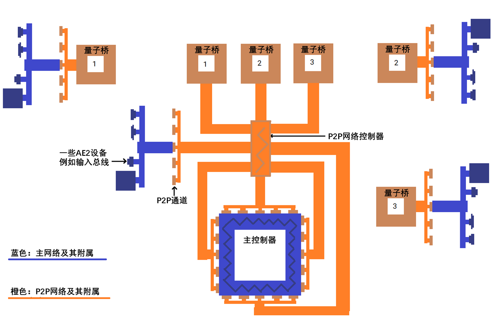

---
navigation:
  parent: items-blocks-machines/items-blocks-machines-index.md
title: P2P Channel
  icon: me_p2p_tunnel
  position: 210
categories:
- devices
item_ids:
- ae2:me_p2p_tunnel
- ae2:redstone_p2p_tunnel
- ae2:item_p2p_tunnel
- ae2:fluid_p2p_tunnel
- ae2:fe_p2p_tunnel
- ae2:light_p2p_tunnel
---

# P2P channel

<GameScene zoom="6" background="transparent">
  <ImportStructure src="../assets/assemblies/p2p_tunnels.snbt" />
  <IsometricCamera yaw="195" pitch="30" />
</GameScene>

P2P channels are a way to transfer items, fluids, redstone signals, energy, light, [channels](../ae2-mechanics/channels.md), and more over a network without having to interact directly with the network. There are many variants of P2P channels, each of which can only transmit one type of thing. Think of them as portals that directly connect two blocks over long distances. This connection has definite inputs and outputs and is not bidirectional.

For example, there is no difference between a hopper facing an item P2P channel and a hopper placed directly on a barrel, and items can be transferred normally.

<GameScene zoom="4" background="transparent">
  <ImportStructure src="../assets/assemblies/p2p_hopper_barrel.snbt" />
  <IsometricCamera yaw="195" pitch="30" />
</GameScene>

However, two barrels placed next to each other will not transfer items to each other.

<GameScene zoom="4" background="transparent">
  <ImportStructure src="../assets/assemblies/p2p_barrel_barrel.snbt" />
  <IsometricCamera yaw="195" pitch="30" />
</GameScene>

There are also other variants, such as redstone P2P channels.

<GameScene zoom="4" background="transparent">
  <ImportStructure src="../assets/assemblies/p2p_redstone.snbt" />
  <IsometricCamera yaw="195" pitch="30" />
</GameScene>

## P2P channel types and tuning

<GameScene zoom="6" background="transparent">
  <ImportStructure src="../assets/assemblies/p2p_tunnels.snbt" />
  <IsometricCamera yaw="180" pitch="90" />
</GameScene>

There are many types of P2P channels. Only ME P2P channels can be synthesized directly. Others require right-clicking on any P2P channel with an item:
- ME P2P channel needs to hold any [cable](../items-blocks-machines/cables.md) and right-click to tune
- The redstone P2P channel needs to be tuned by right-clicking on the redstone component.
- Item P2P channels need to be tuned by right-clicking on a box or funnel.
- Fluid P2P channel requires holding an iron bucket or glass bottle and right-clicking to tune.
- Energy P2P channel needs to hold the energy container and right-click to tune.
- The light P2P channel needs to be tuned by right-clicking on a torch or glowstone.

Some P2P channels have strange characteristics. For example, the channel of the ME P2P channel cannot pass through other ME P2P channels, and the energy P2P channel will deduct 5% of the passing energy (FE, E) through its own [energy] (../ae2-mechanics/energy.md) consumption.

## Most common uses of P2P channels

The most common use of P2P channels is to efficiently transmit [channels](../ae2-mechanics/channels.md) through ME P2P channels. Transmitting a large number of channels no longer requires a bundle of dense cables, one dense cable is enough.

In this example, the 8 ME P2P channel inputs will transmit 256 (8*32) channels from <ItemLink id="controller" /> of the main network, and the remaining 8 ME P2P outputs will send them to other locations. Note that each P2P channel input and output only occupies 1 channel. This allows a large number of channels to be transmitted on a single cable. And because the P2P channels are all in a dedicated [subnetwork](../ae2-mechanics/subnetworks.md), they don't even occupy the main network's channels! Additionally, note that the P2P channel can be placed directly facing the controller, and a [Dense Cable](../items-blocks-machines/cables.md#smart-cable) can be placed between the two to visualize the channel being transmitted.

<GameScene zoom="4" interactive={true}>
  <ImportStructure src="../assets/assemblies/p2p_compact_channels.snbt" />

  <BoxAnnotation color="#dddddd" min="1.3 1.3 6.3" max="2 2.7 6.7">
Quartz fibers will transmit energy between the main network and the P2P sub-network.
  </BoxAnnotation>

  <IsometricCamera yaw="225" pitch="30" />
</GameScene>

Another example (used with [Quantum Bridge](quantum_bridge.md)) can be seen below as a rough drawing:

## Nesting

However, this system cannot transmit unlimited channels in a single cable. Channels of ME P2P channels cannot pass through other ME P2P channels, and therefore cannot be nested within them. Note that the ME P2P channel located on the outer red cable is offline. This property only applies to ME P2P channels. Other types of P2P channels can pass through ME P2P channels, and the redstone P2P channels connected in this way can work normally.

<GameScene zoom="4" background="transparent">
  <ImportStructure src="../assets/assemblies/p2p_nesting.snbt" />
  <IsometricCamera yaw="225" pitch="30" />
</GameScene>

## connect

<GameScene zoom="6" background="transparent">
  <ImportStructure src="../assets/assemblies/p2p_linking_frequency.snbt" />
  <IsometricCamera yaw="195" pitch="30" />
</GameScene>

P2P channel connections can be created with <ItemLink id="memory_card" />. The connection frequency is displayed as a 2x2 color array on the back of the P2P channel.
- Shift right click to generate new P2P connection frequency.
- Right click to paste settings or upgrade card, or connect frequency.

The channel you right-click with Shift is the input terminal, and the channel you right-click is the output terminal. Multiple outputs are allowed, but the channels transmitted by the ME P2P channel will be allocated to each output, rather than each output receiving all channels, thus avoiding channel duplication.

## Recipe

<RecipeFor id="me_p2p_tunnel" />